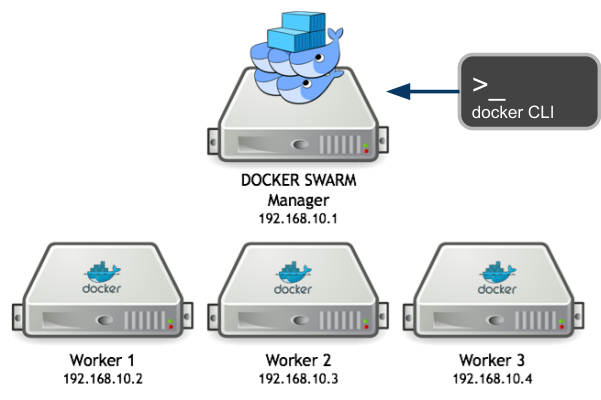
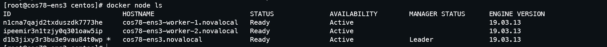
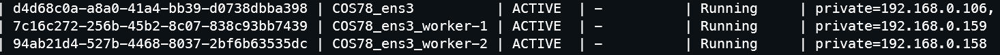
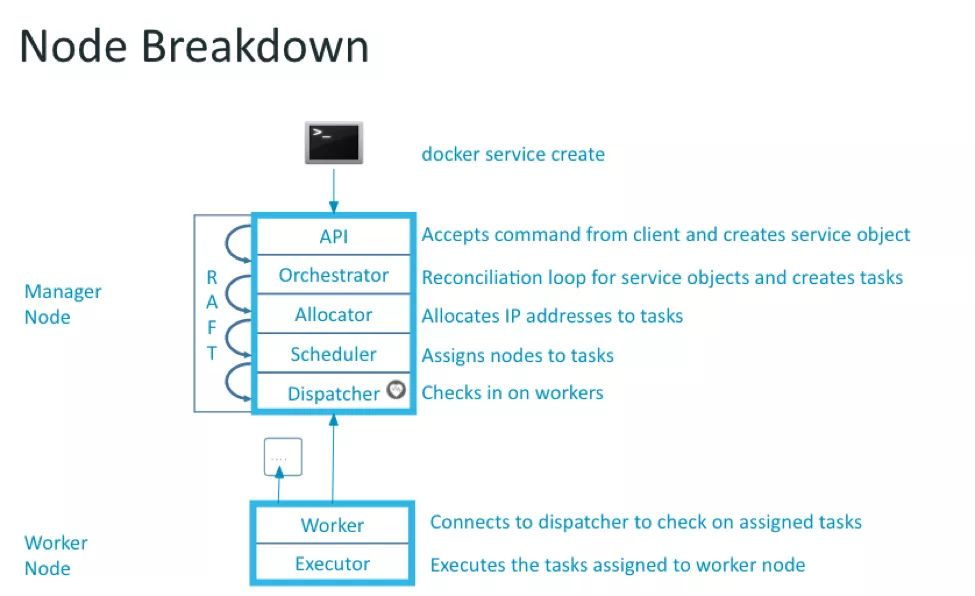
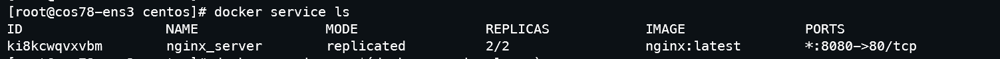
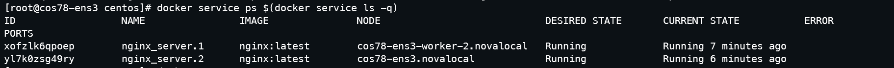
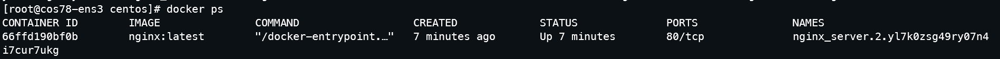
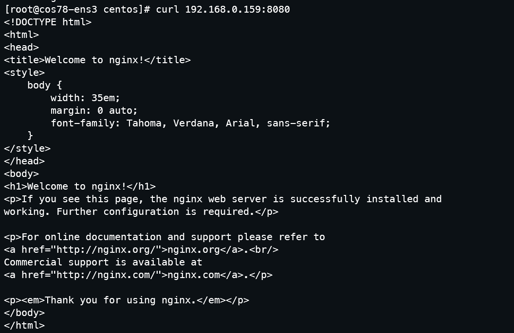
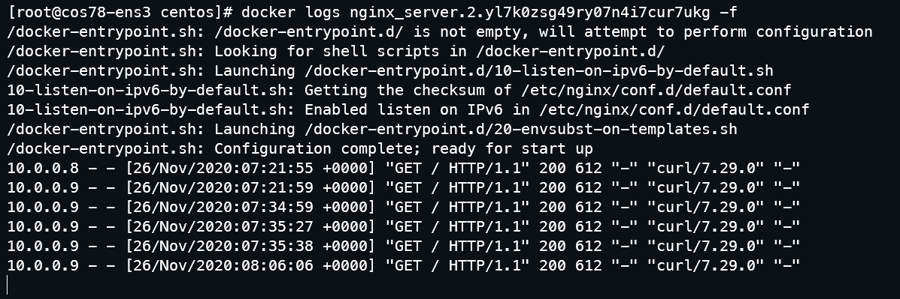

# M2 iLoRD - UE VCC - TP5 - Docker swarm

## Ressources sur Markdown :

* <https://guides.github.com/features/mastering-markdown/>
* <https://guides.github.com/pdfs/markdown-cheatsheet-online.pdf>
* <https://docs.github.com/en/free-pro-team@latest/github/writing-on-github/basic-writing-and-formatting-syntax#further-reading>

## Compte-rendu du TP5 (pages 28-31 du PDF)

> **Suivre le TP pas-à-pas, et compléter les questions signalées par (§)/TODO**

TP5 - Docker swarm / Kubernetes
Won't it be amazing to have a bunch of docker hosts managed like a single one and
to dispatch tasks to them in a simple way :)



References:

- <https://docs.docker.com/engine/swarm/swarm-tutorial/create-swarm/>
- <https://blog.docker.com/2016/07/docker-built-in-orchestration-ready-for-production-docker-1-12-goes-ga/>
- <https://sreeninet.wordpress.com/2017/08/15/docker-features-for-handling-containers-death-and-resurrection>

### 1 - Start a docker swarm manager

Applied to the CloudMIP platform, each user will start an instance featuring a public IP and having docker installed (see **TP4 - Docker). Next is to configure this front-node as a **docker swarm manager**.

```
[root@cos76-ft ~]# yum -y install net-tools
[root@cos76-ft ~]# ifconfig
docker0: flags=4099<UP,BROADCAST,MULTICAST> mtu 1500
    inet 172.17.0.1 netmask 255.255.255.0 broadcast 0.0.0.0
    ether 02:42:56:2a:8a:16 txqueuelen 0 (Ethernet)
    RX packets 0 bytes 0 (0.0 B)
    RX errors 0 dropped 0 overruns 0 frame 0
    TX packets 0 bytes 0 (0.0 B)
    TX errors 0 dropped 0 overruns 0 carrier 0 collisions 0

eth0: flags=4163<UP,BROADCAST,RUNNING,MULTICAST> mtu 1450
    inet 192.168.0.169  netmask 255.255.255.0 broadcast 192.168.0.255
    inet6 fe80::f816:3eff:fe1a:ec15 prefixlen 64 scopeid 0x20<link>
    ether fa:16:3e:1a:ec:15 txqueuelen 1000 (Ethernet)
    RX packets 23914 bytes 32466192 (30.9 MiB)
    RX errors 0 dropped 0 overruns 0 frame 0
    TX packets 6260 bytes 817564 (798.4 KiB)
    TX errors 0 dropped 0 overruns 0 carrier 0 collisions 0

lo: flags=73<UP,LOOPBACK,RUNNING> mtu 65536
    inet 127.0.0.1 netmask 255.0.0.0
    inet6 ::1 prefixlen 128 scopeid 0x10<host>
    loop txqueuelen 1000 (Local Loopback)
    RX packets 0 bytes 0 (0.0 B)
    RX errors 0 dropped 0 overruns 0 frame 0
    TX packets 0 bytes 0 (0.0 B)
    TX errors 0 dropped 0 overruns 0 carrier 0 collisions 0

[root@cos76-ft ~]# docker swarm init --advertise-addr 192.168.0.169
Swarm initialized: current node (v44z77t96kklgrze0nihpa0zy) is now a manager.

To add a worker to this swarm, run the following command:

  docker swarm join \
  --token SWMTKN-1-14u71ujizez36h7lhdjjilg91fcrbnn72rra11gu6j86d43003-dmp53ta60h7cnd4h3suuz78bv \
  192.168.0.169:2377

To add a manager to this swarm, run 'docker swarm join-token manager' and follow the instructions.
```

Note: `docker swarm join-token worker` will remember you the command to join swarm

### 2 - Add docker hosts to the swarm

You now ought to launch 2 x COS78 m1.small instances that will automatically join your docker swarm
manager.

- <https://docs.docker.com/engine/swarm/swarm-tutorial/add-nodes/>

(§) Your solution:

Solution 1:
```
1- Create instance_config.sh script:
#!/usr/bin/env bash
# Install Docker and depenencies
yum -y install yum-utils epel-release
yum-config-manager --add-repo https://download.docker.com/linux/centos/docker-ce.repo
yum -y install docker-ce docker-compose
yum -y install jq
mkdir /dockyard
mkdir /etc/docker
echo '{' >> /etc/docker/daemon.json
echo '"log-driver": "journald",' >> /etc/docker/daemon.json
echo '"data-root": "/dockyard",' >> /etc/docker/daemon.json
echo '"storage-driver": "overlay2",' >> /etc/docker/daemon.json
echo '"storage-opts": [' >> /etc/docker/daemon.json
echo '"overlay2.override_kernel_check=true"' >> /etc/docker/daemon.json
echo '],' >> /etc/docker/daemon.json
echo '"bip": "172.17.0.1/24",' >> /etc/docker/daemon.json
echo '"mtu": 1450,' >> /etc/docker/daemon.json
echo '"fixed-cidr": "172.17.0.0/24"' >> /etc/docker/daemon.json
echo '}' >> /etc/docker/daemon.json
# Retreive meta_data file
curl http://169.254.169.254/openstack/latest/meta_data.json -O
IP=$(jq -r '.meta.ip' < meta_data.json)
TOKEN=$(jq -r '.meta.token' < meta_data.json)
# Start docker
systemctl enable docker
systemctl start docker
# Join swarm cluster
docker swarm join --token $TOKEN $IP:2377

2- Run the following command: 

nova boot --min-count 2 --max-count 2 --flavor m1.small --image COS78 --nic net-id=c1445469-4640-4c5a-ad86-9c0cb6650cca --security-group default --meta ip="YOUR_IP_ADDRESS" --meta token="YOUR_TOKEN" --key-name mykey --user-data instance_config.sh COS78_${OS_USERNAME}_worker
```
In this solution, we pass ip and token as meta parameters while creating workers instances. Then inside the instance we use jq to retrieve IP and TOKEN from meta_data.json (Inspired from TP3) and stock them as an env variables to pass them to the command use to join the cluster.

Solution 2:
```
1- Add variable environments:

- export CLUSTER_MASTER=user@public_ip_address
- export CLUSTER_TOKEN=`ssh $CLUSTER_MASTER "docker swarm join-token worker -q"`

2- Create instance_config.sh script:
#!/usr/bin/env bash
yum -y install yum-utils epel-release
yum-config-manager --add-repo https://download.docker.com/linux/centos/docker-ce.repo
yum -y install docker-ce docker-compose
mkdir /dockyard
mkdir /etc/docker
echo '{' >> /etc/docker/daemon.json
echo '"log-driver": "journald",' >> /etc/docker/daemon.json
echo '"data-root": "/dockyard",' >> /etc/docker/daemon.json
echo '"storage-driver": "overlay2",' >> /etc/docker/daemon.json
echo '"storage-opts": [' >> /etc/docker/daemon.json
echo '"overlay2.override_kernel_check=true"' >> /etc/docker/daemon.json
echo '],' >> /etc/docker/daemon.json
echo '"bip": "172.17.0.1/24",' >> /etc/docker/daemon.json
echo '"mtu": 1450,' >> /etc/docker/daemon.json
echo '"fixed-cidr": "172.17.0.0/24"' >> /etc/docker/daemon.json
echo '}' >> /etc/docker/daemon.json
systemctl enable docker
systemctl start docker
docker swarm join --token $CLUSTER_TOKEN 192.168.0.106:2377


3- Run the following command 

nova boot --min-count 2 --max-count 2 --flavor m1.small --image COS78 --nic net-id=c1445469-4640-4c5a-ad86-9c0cb6650cca --security-group default --meta answer=42 --key-name mykey --user-data instance_config.sh COS78_${OS_USERNAME}_worker
```

In this solution we access to the master node using ssh and execute inside this node "docker swarm join-token worker -q" to retrieve TOKEN and stock it on an env variable that we'll be used in the script instance_config.sh

`Hint: nova boot --min-count 2 --max-count 2 ...`

Ok, to check that all of your CentOS docker hosts have joined your swarm manager:

```
[root@cos76-ft ~]# docker node ls
ID                          HOSTNAME                         STATUS AVAILABILITY MANAGER STATUS
nau6g9zkbqhw7e6vui35xmx2t   cos76-docker1-francois.novalocal Ready  Active
xmx2tgtz6g9zkbqhw7e6vui35   cos76-docker2-francois.novalocal Ready  Active
w7e6vuine5xmx2tu6g9zkbqh3   cos76-docker3-francois.novalocal Ready  Active
v44z77t96kklgrze0nihpa0zy * cos76-ft.novalocal               Ready  Active       Leader
```

The result of this command is shown on the figure below



To have the private ip address of each node of our cluster. We can check on our frontal executing
```
ens3@frontal[~] nova list
```

The result is below (We will use this result after)




### 3 - Launch a simple app

We'd like you to create a service across all of your docker hosts that belong to your swarm.

- <https://docs.docker.com/engine/swarm/swarm-tutorial/deploy-service/>



```
docker service create --replicas 1 --name helloworld alpine ping cloudmip.univ-tlse3.fr
docker service ls
docker service inspect <service ID>
docker service ps
```

**docker service create**

When creating a docker service, what's all this stuff about `--mode replicated` vs `global`?

Hint: <https://docs.docker.com/engine/reference/commandline/service_create/#options>

(§) Your answer:
```
-- mode global launch a replica of the service in every node in our cluster (for example in our case we'll have three replicas of the service helloworld)
-- mode replicated: we specify the number of replicas and swarm will orchestrate those replicas all over the cluster nodes.
```

How will you launch a HTTP service on all of your docker hosts from your swarm ?

(§) Your answer:
```
docker service create --mode global --name my_global_service alpine

This command will create 3 replicas (number of cluster nodes) of the service named my_global_service based on alpine image.
```

### 4 - Launch a real simple app

In this phase, we'll create a service with 2 replicas. We'll explore results to explain service component of docker swarm. The app created is a nginx server.

The command below is used to create that service and publish the port 80 of the service to our 8080 host port.

```
[root@cos78-ens3 centos]# docker service create --replicas 2 --name nginx_server --publish published=8080,target=80 nginx
```

We can check that our service is created.
```
[root@cos78-ens3 centos]# docker service ls 
```

The result of this command is shown below:



After that, we want to check in which node our replicas are deployed. We execute the command:

```
[root@cos78-ens3 centos]# docker service ps $(docker service ls -ql)
```
The result of this command is shown below:



The result shows that one replica is deployed on our worker2 and the other on the leader node (no replica is deployed on worker1).

As we are one the leader node (master node), we can check that the second replica is really deployed on that node. 

We execute on that node:

```
[root@cos78-ens3 centos]# docker ps
```
The result of this command is shown below:



We can see that the ID of the container running on that node is the same as mentionned on the previous result.

A question is to be asked. How swarm manage/load balance requests comming to a service with multiple replicas?

After doing some researches, we found that it used a round robin algorithm to load balance the trafic to different replicas.

Another question. If we want to request our service, which ip address we'll use?

After doing some researches, we found that we can use any address of our node cluster.

We want to explore those results so:

We'll observe logs of the replicas deployed on our master node. We execute:

```
[root@cos78-ens3 centos]# docker logs nginx_server.2.yl7k0zsg49ry07n4i7cur7ukg -f
```

On the other hand, we'll request our application using the ip address of the worker1 (where no one of our replicas is deployed).

The result is shown below 



As we can see, we get the response even if we request a node that doesn't have any replicas of the service.

In the other hand, to check that swarm uses round robin load balancing, we observe logs and we'll find that one request is arrived to the instance and the posterior request is routed to the other instance.

Below, the result of our logs




### 5 - Fedora Atomic

The Atomic project aims at providing the ability for Cloud platforms to become versatile enough to run
docker containers. This objective is achieved through the availability of an image named 'Fedora atomic' that you launch like others instances but that only provides docker support.

- <http://www.projectatomic.io/docs/quickstart/>

(§) Explore the various aspects of Fedora Atomic and try to bring out the major differences with regular Fedora image we've been using from the beginning.

```
Fedora Atomic is a variation of ffedora created by the atomic group. It's mostly oriented to run containers with orchestration stack (as kubernetes or docker swarm).

Atomic has an immutable file system (That means that we con't touch it: We can't create files in / for example). It's an OS with minimal size (400 mb). 

REASONS USING ATOMIC:

Containers are a powerful and flexible way to deploy and manage server applications, with numerous benefits such as density, ease of deployment, and orchestration. The Atomic Host is optimized for running containers, coming out of the box with storage tuned for Docker and atomic upgrades.

In addition, we can summarize all that in those five points: **Transactional Updates, Immutability and Isolation, Effortless Change Tracking, Upstream Testing, Automatic Updates**
```

### 6 - Bonus

(§) Docker vs **Singularity**: summarizes the key differences.
```
After seeing docker in VCC and TILD courses. Singularity has another point of view. It's used especially for High Performance Computing (So it's mostly used by scientific application users). It uses HPC libraries like MPI (It's not the case of Docker). 

With Singularity we produce only one image which il contain all dependencies unlike Docker which was destined to microservice applications. 

Last versions of Singularity supports the use of docker inside it.

I found an interesent link (but not new) with multiple comparaison pane between Docker and Singularity (link above).

https://tin6150.github.io/psg/blogger_container_hpc.html
```

(§) How to share data across several VMs / containers ?
```
One of technics used to share data between containers is to use persistant volumes.
1- Create persistante volume.
2- Create container with data volume attached (data volume created in step 1).
3- Create a second container and mount the volumes from the first container.

Those steps allow us to share data across containers. This method allows us also to share data across containers and the host where we deployed our containers.
```

(*Multiple answers possible*)

Now, you're a container manager and you ought to give root access to users inside a container …
this means that your container needs to run both the user application along with a ssh daemon.  
(§) Describe a `Dockerfile` based on `supervisord` able to implement this behaviour.
```
TODO
```

### Annexe - A | Openstack addon commands

We'll show simple use of the CloudMIP platform within the service project

**create image from instance | nova snapshot**

Creating a snapshot from a running instance

```
nova image-create --poll <instance_name> <snapshot_name>
nova image-create --poll private-instance COS76snap
```

… boot a new instance from this snapshot

```
nova boot --flavor same_flavour --image <snapshot_name> --nic \
  net-id=c1445469-4640-4c5a-ad86-9c0cb6650cca --security-group default --key-name \
  mykey <snapshot instance name>
nova boot --flavor m1.small --image COS76snap --nic \
  net-id=c1445469-4640-4c5a-ad86-9c0cb6650cca --security-group default --key-name \
  mykey myCOS76snap
```

**Add Fedora atomic image**

Search for Openstack atomic image

`https://...`

```
glance image-create --name FC29_atomic --disk-format=qcow2 --container-format=bare `
  --visibility public --progress --file Fedora-AtomicHost-29-20181025.1.x86_64.qcow2
openstack image list
glance image-list
```

To add FC29 Openstack image (i.e featuring Cloud-init support)

- <https://getfedora.org/cloud/download/>

… and repeat same process as above.

**Persistent storage | cinder volumes**

We'll add a persistent storage (cinder, i.e block) to an instance

```
cinder create --name FT_lv 4
# Note: size in GB
```

```
nova list
cinder list  or  nova volume-list
nova volume-attach INSTANCE_NAME VOLUME_ID
nova volume-attach public-instance 1372f518-f06d-4ff5-9c3d-b31325ff3e51
```

**log to VM [root only] direct SSH access to an instance and prepare newly attached storage**

```
francois@frontal[~] sudo ip netns exec qdhcp-c1445469-4640-4c5a-ad86-9c0cb6650cca
ssh -i ~/.ssh/id_rsa fedora@192.168.0.153
Warning: Permanently added '192.168.0.153' (ECDSA) to the list of known hosts.
Last login: Thu Sep 8 11:23:12 2016 from 192.168.0.1

[fedora@private-instance-wn1 ~]$ sudo su

[root@private-instance-wn1 fedora]# fdisk -l
Disk /dev/vda: 20 GiB, 21474836480 bytes, 41943040 sectors
Units: sectors of 1 * 512 = 512 bytes
Sector size (logical/physical): 512 bytes / 512 bytes
I/O size (minimum/optimal): 512 bytes / 512 bytes
Disklabel type: dos
Disk identifier: 0x06d4f68c

Device Boot Start End  Sectors Size Id Type
/dev/vda1 * 2048 41943039 41940992 20G 83 Linux

Disk /dev/vdb: 1 TiB, 1099511627776 bytes, 2147483648 sectors
Units: sectors of 1 * 512 = 512 bytes
Sector size (logical/physical): 512 bytes / 512 bytes
I/O size (minimum/optimal): 512 bytes / 512 bytes

- create a partition /dev/vdb1
- dnf -y install xfsprogs
- mkfs.xfs /dev/vdb1
- mount newly created partition … et voilà :)
```

### Annexe - B - 1 | Docker commands

Functional test:

```
docker info
docker run hello-world
```

- <https://reseau-loops.github.io/presentations/2015-12-17-sebastien-binet-docker.pdf>

Functional test

```
docker info
docker run hello-world
```

```
docker ps → list running dockers
docker ps -a → list ALL dockers (even those in a stopped state)

# you added / modified a running container → commit changes to images
docker commit -m 'update' <containerID> <image_name:tag>
docker commit 5fab36bbec1e sensocampus/django:latest

# Ctrl p Ctrl q → this will disconnect from a connected container

# Attach to a running docker you've disconnected from
docker attach <containerName>

# execute a command within a running container
docker exec -it <container_name> bash

# to run a specific entry point for a docker
docker run -it --entrypoint bash mqttocampus

# view containers' logs (trapped stdout and stderr)
docker logs -ft <container_name>

# view journalctl entries from host
journalctl -ef CONTAINER_NAME=<container_name>
# Note: it is '-ef', not '-efu

# create, list, inspect volumes
docker volume create -d local --name mysql-idex -o size=20G
(it seems that size does not matter with this driver)

# attach a host directory
docker run -v <host_dir>:<container_dir> …

# attach a volume
docker run -v <vol_name>:<container_dir> ...

# list network resources
docker network ls
docker network inspect bridge

# Attach a volume from a container dedicated as volume holder
TODO

# to launch a specific command from an image: run shell from alpine linux
docker run -it --rm alpine sh

# to rename a image (is only a link)
docker tag '<imageID>' name:tag

# build
docker build --no-cache -t name:tag -f mydockerfile .

# a container failed to build … how to enter within ?
docker commit `docker ps -q -l` failure
docker run -it failure /bin/bash

# save docker image(s)
docker save -o neocampus.tar mqttOCampus:latest sensocampus/django:latest …

# load saved docker images
docker load -i neocampus.tar

# save a data volume
docker stop mongo-neOCampus

docker run --rm -v volumename:/vol -w /vol alpine tar -c . > volume. tar

# load saved data volumes
docker run --rm -v volumename:/vol -w /vol -i alpine tar -x < volume. tar

# copy files from container to local dir
docker cp <container>:/<remote_dir> <local_dir>
# e.g
docker cp mongo-neocampus:/dump .

X application

# to allow a X-application to display things from inside the container
xhost +
docker … -v /tmp/.X11-unix:/tmp/.X11-unix:rw ...

# launch docker with full access to devices
docker … --privileged ...

# launch docker in the host's network (i.e direct export of ports)
# Note: privileged mode implies network host
docker … --network host ...

# stats
docker stats
# features R/W for Net I/O and Block I/O and number of threads
```

### Annexe - B - 2 | docker-compose commands

```
# check yml file
docker-compose -f <file.yml> config

# UP
docker-compose --verbose -f <file.yml> up -d [service]

# DOWN
docker-compose --verbose -f <file.yml> down

# RESTART
docker-compose --verbose -f <file.yml> restart <service>
```

### (DEPRECATED) docker config files

Please make use the **new** `/etc/docker/daemon.json` config file … these are for reference only!

- `/etc/sysconfig/docker`

```
…
OPTIONS='-g /dockyard --log-driver=journald --signature-verification=false'
…
```

- `/etc/sysconfig/docker-network`

```
DOCKER_NETWORK_OPTIONS="--mtu=1450 --bip=172.17.0.1/24 --fixed-cidr=172.17.0.0/24"
```
